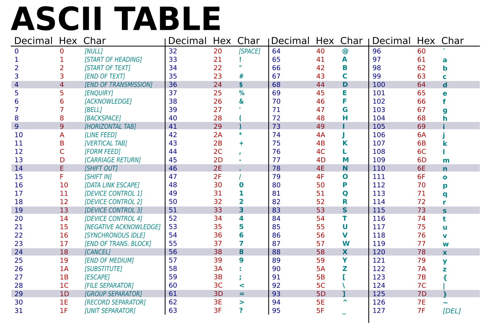

# Exercise: Binary numbers and their representations

In this exercise, you will explore how binary numbers are used to
represent various forms of data, including text, images, and colors. By
the end of this exercise, you will have a deeper understanding of how
computers use binary to process and display information.

Source: https://simple.m.wikipedia.org/wiki/File:ASCII-Table-wide.svg

Part 1: Binary to ASCII

1.  Convert the following binary numbers to their ASCII characters:

01001000

01100101

01101100

01101100

01101111

2.  Write a short message using binary ASCII codes and let your
    wingman/-woman interpret it:

Example: 01001000 01101001 (Hint: This spells "Hi")

3.  What are the colors:

    a.  Red: 00110011 Green: 01100110 Blue: 11111111

    b.  Red: 11111111 Green: 11111111 Blue: 00000000

    c.  Red: 11001100 Green: 11001100 Blue: 11111111

Source: https://excelatfinance.com/xlf/xlf-colors-1.php

5.  Challenge:

    a.  Create a binary representation for the word "Code" using ASCII
        values.

    c.  Choose a color and represent it in binary using the RGB model.
